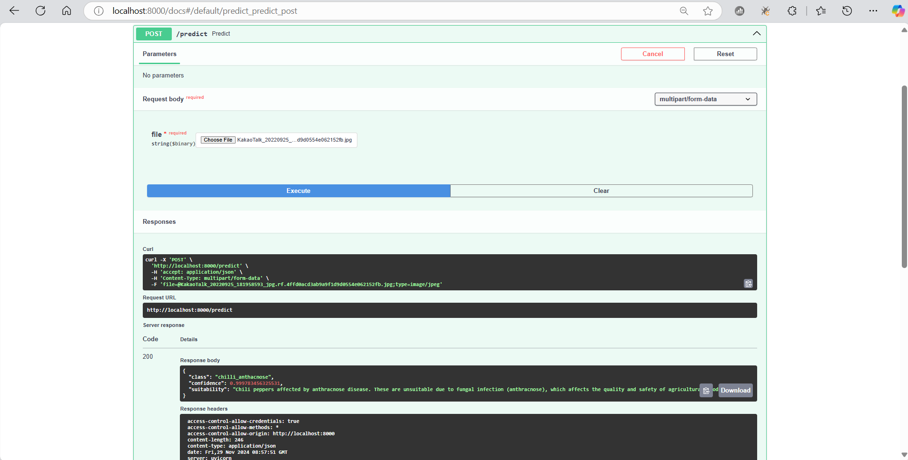
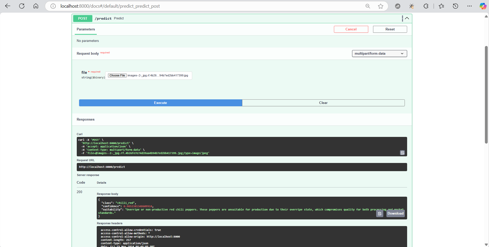
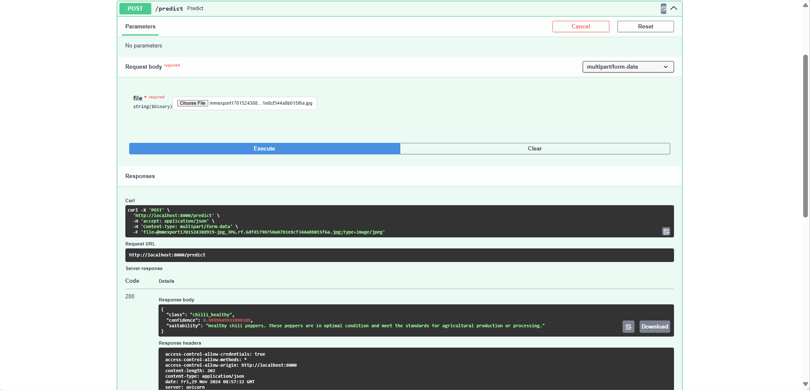
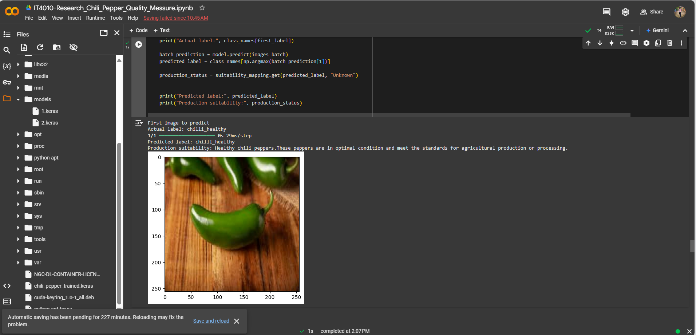
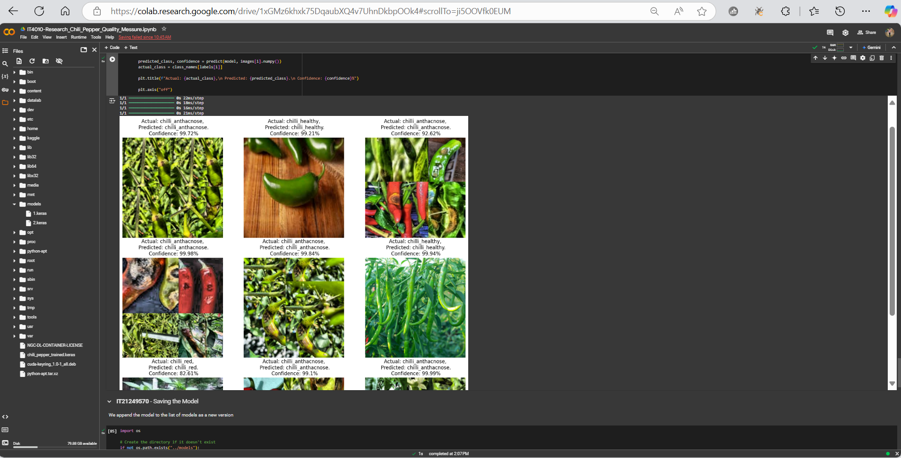

# Research_Chili_Village_Project
Chili Pepper Quality Assessment Using CNN
Project Overview
This project applies deep learning techniques, specifically Convolutional Neural Networks (CNNs), to assess the quality of chili peppers. The dataset contains three classes of chili peppers:

Healthy Chili Peppers: Suitable for production.
Chili Red: Overripe peppers that are not good for production.
Chili Anthracnose: Disease-affected peppers unsuitable for production.
The model predicts the class of the chili pepper and determines its production suitability based on the predicted class.

Features
Image Classification: Classifies chili peppers into three categories using a CNN model.
Suitability Mapping: Maps the predicted class to a production suitability status:
Healthy → Good for production
Chili Red → Not for production
Chili Anthracnose → Not for production
Visualization: Displays test dataset predictions with confidence levels and suitability status.

Chili Pepper Quality Identification API

This project uses a machine learning model to identify diseases in potato leaves via a web-based API using FastAPI. The API allows users to upload images of chili pepper images and returns a prediction indicating whether the chili pepper is healthy or affected by any disease & whether it is good for production or not.

How It Works: Image Upload: Users upload an image of a chili pepper to the /predict endpoint. Preprocessing: The image is resized and normalized to match the model's input requirements. Model Prediction: The pre-trained model processes the image and predicts the class of disease (or "Healthy"). Response: The API returns the predicted disease class along with a confidence score.

#Upload file to the predict Endpoint & check the trained model(Anthacnose_Disease)



#Upload file to the predict Endpoint & check the trained model(Chili_Red)



#Upload file to the predict Endpoint & check the trained model(Chili_Healthy)



#To run the Faster Endpoint application

1.download the neccssary dependencies

2.navigate to the directory (api) & run the below command to start the application

```
uvicorn main:app --host localhost --port 8000 --reload
```

Prediction with colab

#check the trained model for 3 classes




