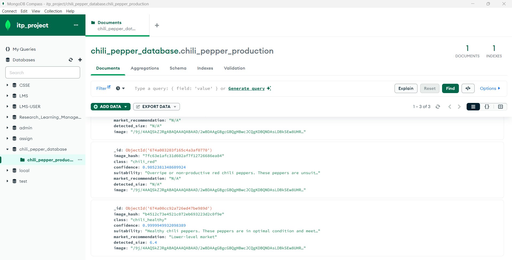

# Research_Chili_Village_Project
Chili Pepper Quality Assessment Using CNN
Project Overview
This project applies deep learning techniques, specifically Convolutional Neural Networks (CNNs), to assess the quality of chili peppers. The dataset contains three classes of chili peppers:

Healthy Chili Peppers: Suitable for production.
Chili Red: Overripe peppers that are not good for production.
Chili Anthracnose: Disease-affected peppers unsuitable for production.
The model predicts the class of the chili pepper and determines its production suitability based on the predicted class.

Features
Image Classification: Classifies chili peppers into three categories using a CNN model.
Suitability Mapping: Maps the predicted class to a production suitability status:
Healthy → Good for production
Chili Red → Not for production
Chili Anthracnose → Not for production
Visualization: Displays test dataset predictions with confidence levels and suitability status.

Chili Pepper Quality Identification API

This project uses a machine learning model to identify diseases in potato leaves via a web-based API using FastAPI. The API allows users to upload images of chili pepper images and returns a prediction indicating whether the chili pepper is healthy or affected by any disease & whether it is good for production or not.

How It Works: Image Upload: Users upload an image of a chili pepper to the /predict endpoint. Preprocessing: The image is resized and normalized to match the model's input requirements. Model Prediction: The pre-trained model processes the image and predicts the class of disease (or "Healthy"). Response: The API returns the predicted disease class along with a confidence score.

OpenCV for Identifying Chili Pepper Height
In this project, we use OpenCV (Open Source Computer Vision Library) to identify the size (height) of chili peppers in an image. This process involves a series of image processing techniques that allow us to estimate the height of the chili pepper in feet based on its pixel dimensions. Here's a brief breakdown:

Convert the Image to Grayscale: First, we convert the image to grayscale because the color is not important for detecting the shape and contours of the chili pepper.

Thresholding: After converting to grayscale, we apply a binary thresholding technique to separate the object (chili pepper) from the background. This helps us in creating a clear distinction between the chili pepper and its surroundings.

Contour Detection: Using OpenCV's contour detection function, we identify the boundaries of the chili pepper in the image. The largest contour is assumed to be the chili pepper itself.

Bounding Box and Height Calculation: We use the bounding rectangle of the largest contour to calculate the height. The height (in pixels) is then converted to feet using a mock conversion factor. This method provides a quick and efficient way to estimate the size of the chili pepper.

Using OpenCV for such tasks helps in automating the process of image analysis, which is crucial for large-scale applications where manual measurement is not feasible.



#Upload file to the predict Endpoint & check the trained model(Anthacnose_Disease)


#Upload file to the predict Endpoint & check the trained model(Chili_Red)


#Upload file to the predict Endpoint & check the trained model(Chili_Healthy)


#To run the Faster Endpoint application

1.download the neccssary dependencies

2.navigate to the directory (api) & run the below command to start the application

```
uvicorn main:app --host localhost --port 8000 --reload
```

Prediction with colab

#check the trained model for 3 classes


